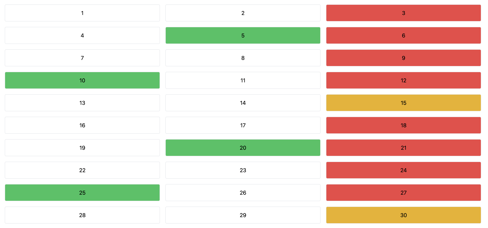

### IBM

This is a technical test for IBM.

The T1 is doing a grid of boxes that hold number from 1 to 100.
Each box get different color depending of the number that it hold.

If the number is divisible by 3 the box is red.

If the number is divisible by 5 the box is green.

If the number is divisible by 3 and 5 the box is yellow​.

## Getting Started

First, run the development server:

```bash
npm i
npm run dev
```

Open [http://localhost:3000](http://localhost:3000) with your browser to see the result.
The result look like this :


## Testing

Testing is done with cypress.

```bash
npm run cypress
```

And choice the test that you want to launch from the list.
